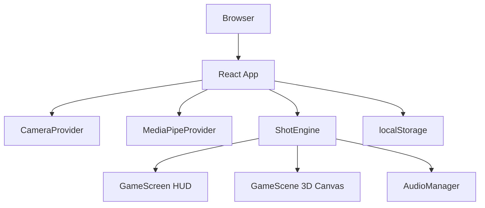
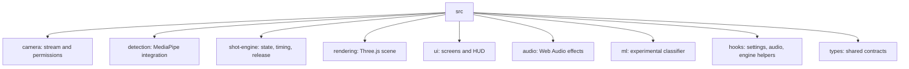
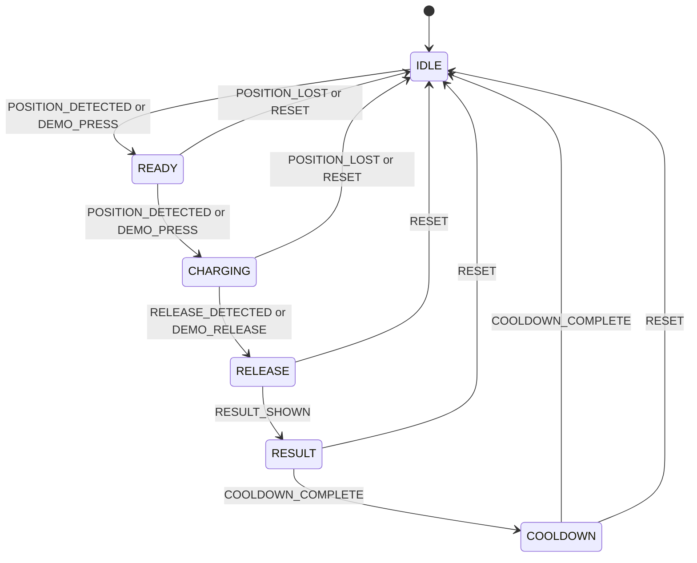
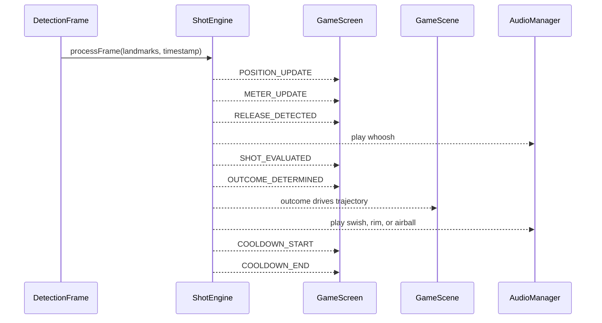

# Buckets

Buckets is a browser-based basketball shooting trainer that turns a laptop camera into a motion-controlled shootaround. The app watches a user's shooting form through webcam landmarks, detects when the user enters a shooting stance, starts a 2K-style timing meter, detects release motion, and animates a 3D basketball shot toward a hoop.

The project is intentionally client-side first. Camera frames are processed in the browser, gameplay state lives in the React app, the 3D scene renders with Three.js, and deployment is a static Vite build. The result is a low-ops, privacy-conscious prototype that demonstrates how real-time computer vision, state machines, and interactive rendering can be combined into a playable training experience.

## Table of Contents

- [Why This Exists](#why-this-exists)
- [What Was Built](#what-was-built)
- [Current Capabilities](#current-capabilities)
- [Tech Stack](#tech-stack)
- [Quick Start](#quick-start)
- [Runtime Requirements](#runtime-requirements)
- [User Experience](#user-experience)
- [Architecture](#architecture)
- [Shot Detection System](#shot-detection-system)
- [3D Rendering System](#3d-rendering-system)
- [Audio, Settings, and Persistence](#audio-settings-and-persistence)
- [ML and Hybrid Detection Path](#ml-and-hybrid-detection-path)
- [Project Structure](#project-structure)
- [Deployment](#deployment)
- [Privacy Model](#privacy-model)
- [Engineering Notes](#engineering-notes)
- [Known Limitations](#known-limitations)
- [Verification Status](#verification-status)
- [Future Work](#future-work)

## Why This Exists

Most basketball training tools need a court, a hoop, a ball, sensors, or a mobile app setup. Buckets explores a smaller, more accessible idea: can a normal browser and laptop webcam create a meaningful shootaround loop?

The motivation was to build a playable prototype that gives users:

- A fast way to practice release timing without special hardware.
- A game-like interface that feels closer to a basketball video game than a static form checker.
- Real-time feedback from actual body motion instead of button-only input.
- A privacy-friendly architecture where webcam frames stay in the browser.
- A clean engineering foundation that can be extended with better form scoring, real training data, and richer practice modes.

From an engineering perspective, this project is valuable because it ties together several difficult pieces:

- Real-time camera access and permission handling.
- Browser-based pose and hand landmark detection.
- A deterministic shot lifecycle implemented as a state machine.
- Timing-sensitive release detection with smoothing, debounce, and cooldown logic.
- 3D rendering and animation synchronized with gameplay events.
- A camera-free demo mode so the game remains testable without hardware.

## What Was Built

The current repository is no longer a starter scaffold. It contains a modular Vite + React + TypeScript application named Buckets.

Major implementation areas:

- **Camera pipeline**: Requests webcam access with `getUserMedia`, manages stream lifecycle, and maps common camera failures into app states.
- **MediaPipe detection pipeline**: Loads MediaPipe Holistic from jsDelivr, processes a hidden video stream, normalizes pose and hand landmarks, and emits throttled detection frames.
- **Shot engine**: Coordinates form detection, release detection, meter timing, outcome resolution, and lifecycle transitions.
- **Rules-based detector**: Uses elbow angle, wrist position, landmark confidence, stable frame counting, wrist velocity, hand separation, and debounce timing.
- **Game UI**: Includes landing, onboarding, camera permission flow, settings, live game overlay, debug overlay, result feedback, and demo mode input.
- **3D scene**: Renders a half-court, hoop, net, basketball, position markers, animated shot trajectory, and net movement.
- **Audio system**: Generates synthetic Web Audio effects for release and shot outcomes.
- **Settings persistence**: Stores user settings in `localStorage`.
- **Vercel compatibility**: Uses Vite build output with `vercel.json` configured for static deployment.

## Current Capabilities

Buckets currently supports two play paths.

### Live Camera Mode

Live mode uses the user's webcam and browser-based landmark detection.

1. User starts from the landing screen.
2. App requests camera permission during onboarding.
3. User selects dominant hand and difficulty.
4. MediaPipe Holistic tracks pose and hand landmarks from a hidden video element.
5. The shot engine detects when the user enters shooting form.
6. The timing meter starts filling.
7. Release motion is detected from wrist velocity and hand separation signals.
8. The meter zone determines the result.
9. The 3D scene animates the ball and net.
10. The UI enters cooldown before another attempt.

### Demo Mode

Demo mode bypasses camera and MediaPipe. It uses the same timing and outcome mechanics, but input comes from the spacebar:

- Hold `Space` to charge the meter.
- Release `Space` to shoot.
- The same green/yellow/red timing zones determine the result.

This path is useful for testing gameplay, presenting the app without camera access, and keeping the app usable on devices where webcam permissions are blocked.

## Tech Stack

| Layer | Technology | Purpose |
| --- | --- | --- |
| Runtime and package manager | Bun | Dependency installation and script execution |
| App framework | React 19 | Component-based UI |
| Language | TypeScript | Type safety across UI, engine, detection, and rendering modules |
| Build tool | Vite | Dev server, production build, static output |
| Computer vision | MediaPipe Holistic | Browser pose and hand landmark detection |
| ML runtime | TensorFlow.js | Experimental model loading and classifier path |
| 3D rendering | Three.js | Court, hoop, ball, net, lighting, and materials |
| React 3D integration | `@react-three/fiber` | Declarative Three.js rendering inside React |
| Audio | Web Audio API | Synthetic whoosh, swish, rim, and airball effects |
| Persistence | `localStorage` | User settings persistence |
| Hosting | Vercel | Static Vite deployment target |

## Quick Start

Install dependencies:

```bash
bun install
```

Start the local development server:

```bash
bun run dev
```

The Vite dev server is configured for port `3000`, so the local app should be available at:

```text
http://localhost:3000
```

Create a production build:

```bash
bun run build
```

Preview a production build locally:

```bash
bun run preview
```

Run TypeScript checking:

```bash
bun run typecheck
```

### Available Scripts

These scripts are defined in `package.json`.

| Command | What it does |
| --- | --- |
| `bun run dev` | Starts the Vite development server |
| `bun run build` | Creates the Vite production build in `dist` |
| `bun run preview` | Serves the built app locally for preview |
| `bun run typecheck` | Runs `tsc --noEmit` |

There is currently no tracked `test` script.

## Runtime Requirements

For live camera mode:

- A modern desktop browser with WebRTC camera support.
- A working webcam.
- Camera permission granted to the site.
- A secure context for deployed usage, meaning HTTPS in production.
- Network access to jsDelivr for MediaPipe Holistic runtime assets.

For demo mode:

- A modern browser.
- Keyboard access for the spacebar input flow.
- No camera is required.

The app is best suited for desktop/laptop browsers. The implementation targets a seated laptop scenario with a front-facing camera.

## User Experience

### Landing

The landing screen introduces Buckets and offers two paths:

- **Shoot Around**: starts the camera onboarding flow.
- **Try Demo Mode**: starts the game without camera access.

It also checks whether a camera appears available and shows a warning if not.

### Onboarding

The onboarding flow walks the user through:

- Welcome screen.
- Camera permission request.
- Dominant hand selection.
- Difficulty selection.
- Short gameplay tutorial.

If camera permission is denied, the UI offers demo mode as a fallback.

### Live Game Screen

The game screen layers a transparent HUD over the 3D court:

- Make/attempt count.
- Accuracy percentage.
- Current streak.
- State indicator such as `Get Ready`, `Charging...`, `Release!`, and cooldown text.
- Horizontal shot timing bar.
- Vertical 2K-style timing meter.
- Result overlay for makes and misses.
- Camera preview in live mode.
- Debug overlay with camera status, detection status, FPS, pose visibility, and form detection details.
- Settings and exit controls.

### Settings

Settings include:

- Sound effects on/off.
- Volume slider.
- Dominant hand.
- Difficulty.
- Court position.

Settings are persisted in browser `localStorage` under `buckets_settings`.

## Architecture

At a high level, Buckets is a React app that coordinates three real-time systems:

- Camera and landmark detection.
- Shot lifecycle and timing logic.
- 3D rendering and UI feedback.



### Live Camera Data Flow


### Module Map



### Runtime Composition

The live game path is composed as:

```text
App
  -> GameWithProviders
    -> CameraProvider
      -> MediaPipeProvider
        -> GameController
          -> ShotEngine
          -> GameScene
          -> GameScreen
```

Demo mode skips `CameraProvider` and `MediaPipeProvider`:

```text
App
  -> GameWithProviders
    -> GameController demoMode=true
      -> ShotEngine
      -> GameScene
      -> GameScreen
      -> DemoModeInput
```

## Shot Detection System

The active app path is rules-based by default. The default `ShotEngineConfig` uses:

```text
detectorType: "rules"
```

This means live gameplay does not depend on the experimental TensorFlow.js model path.

### Shot State Machine

The shot lifecycle is implemented as a state machine.



The states mean:

| State | Meaning |
| --- | --- |
| `IDLE` | Waiting for the user to enter shooting form |
| `READY` | Shooting form has been detected |
| `CHARGING` | Timing meter is active and release detection is running |
| `RELEASE` | A release event was detected and timing is evaluated |
| `RESULT` | Shot outcome is shown and the 3D ball animation runs |
| `COOLDOWN` | Short pause before accepting another shot |

### Engine Events

The shot engine emits events that decouple detection logic from rendering and UI.



Important event types include:

- `STATE_CHANGE`
- `POSITION_DETECTED`
- `POSITION_LOST`
- `POSITION_UPDATE`
- `METER_UPDATE`
- `RELEASE_DETECTED`
- `SHOT_EVALUATED`
- `OUTCOME_DETERMINED`
- `COOLDOWN_START`
- `COOLDOWN_END`
- `USER_OUT_OF_FRAME`
- `USER_IN_FRAME`
- `DEMO_INPUT`

### Position Detection

Rules-based position detection uses the dominant side of the body:

- Shoulder landmark.
- Elbow landmark.
- Wrist landmark.
- Landmark confidence.
- 2D elbow angle.
- Wrist position relative to elbow.
- Stable frame counting.

Key behavior:

- Uses the configured dominant hand, left or right.
- Rejects missing landmarks.
- Rejects landmarks below the configured confidence threshold.
- Filters physically unrealistic elbow angles.
- Smooths elbow angle with an exponential moving average.
- Allows a small wrist-below-elbow tolerance to reduce false negatives.
- Requires several stable frames before declaring the user in position.

The default position configuration is intentionally permissive because laptop camera angles are noisy:

| Setting | Default behavior |
| --- | --- |
| Minimum elbow angle | Filters extreme low-angle noise |
| Maximum elbow angle | Allows extended shooting positions |
| Wrist above shoulder required | Disabled in current defaults |
| Minimum confidence | Low enough for MediaPipe visibility values in typical webcam conditions |
| Stability frames | Requires multiple valid frames before triggering |

### Release Detection

Release detection runs during `CHARGING`.

It combines:

- Dominant wrist position over a short frame window.
- Wrist velocity.
- Exponential moving average velocity smoothing.
- Peak velocity tracking.
- Velocity drop/deceleration detection.
- Hand separation when both wrists are available.
- Minimum prep time.
- Debounce time to prevent double-triggering.

The detector can fire in two broad cases:

- **Early velocity spike**: wrist velocity crosses a threshold after prep time.
- **Velocity inflection**: velocity peaks and then drops enough to count as a release.

When hand separation is available, it contributes to confidence. If separation is unavailable, the detector can still fall back to velocity-only release detection.

### Timing Meter

The timing meter starts when the engine enters `CHARGING`.

It maps elapsed time to a normalized value from `0` to `1`, then classifies the current value as:

- `green`
- `yellow`
- `red`

Difficulty changes the fill duration and timing windows:

| Difficulty | Fill duration | Green window | Yellow width |
| --- | ---: | --- | --- |
| `easy` | 6000 ms | 0.30 to 0.70 | 0.20 |
| `medium` | 4000 ms | 0.375 to 0.625 | 0.15 |
| `hard` | 2500 ms | 0.425 to 0.575 | 0.10 |
| `pro` | 2000 ms | 0.46 to 0.54 | 0.06 |

### Outcome Logic

Shot results are intentionally simple and game-like:

| Timing zone | Outcome behavior |
| --- | --- |
| `green` | Guaranteed `swish` |
| `yellow` | 50 percent `rim_in`, 50 percent `rim_out` |
| `red` | `airball` |

This keeps the MVP understandable: better release timing produces better shot outcomes.

## 3D Rendering System

The rendering layer uses `@react-three/fiber` and Three.js to create a full-screen court scene.

Major scene components:

- `GameScene`: owns the Three.js canvas, lighting, camera controller, and scene composition.
- `Court`: renders the half court, paint, free throw line, three-point arc, baseline, and shooting position markers.
- `Hoop`: renders backboard, target box, rim, connector, and support pole.
- `Net`: renders strand and ring geometry and animates net movement after made shots.
- `Ball`: renders the basketball and applies trajectory position, scale, and spin.
- `Trajectory`: calculates parabolic shot arcs and ball rotation.
- `sceneConfig`: defines camera positions, hoop position, rim radius, ball start points, and arc heights.

### Court Positions

The app supports five court positions:

- `free-throw`
- `top-key`
- `left-wing`
- `right-wing`
- `corner`

Each position has:

- Camera position.
- Camera target.
- Ball start position.
- Trajectory arc height.

### Shot Animation

When the shot state reaches `RESULT`, the selected outcome creates a trajectory:

- `swish`: ball drops cleanly through the net.
- `rim_in`: ball drops through after a rim-style path.
- `rim_out`: ball hits high and misses.
- `airball`: ball misses high and behind the rim.

The ball follows a parabolic path, shrinks slightly for perspective, and rotates with backspin.

## Audio, Settings, and Persistence

### Audio

The audio system uses generated Web Audio API sounds instead of asset files.

Effects:

- `whoosh`: played on release.
- `swish`: played for clean makes.
- `rim`: played for rim-in and rim-out outcomes.
- `airball`: played for airballs.

`useAudio` lazily creates an `AudioManager`, which avoids creating an audio context until a user interaction path triggers sound.

### Settings

User settings include:

- Dominant hand.
- Difficulty.
- Court position.
- Sound enabled.
- Sound volume.

Defaults:

```ts
{
  dominantHand: "right",
  difficulty: "medium",
  courtPosition: "free-throw",
  soundEnabled: true,
  soundVolume: 0.7
}
```

Settings are persisted under:

```text
buckets_settings
```

### Important Audio Caveat

The settings UI exposes a volume slider and the audio manager supports volume internally. In the current app wiring, `settings.soundVolume` does not appear to be applied back into the active `AudioManager` at runtime. The README documents the UI and the implementation accurately, but this should be fixed before claiming complete runtime volume control.

## ML and Hybrid Detection Path

The repository includes an ML-oriented path, but it is not the active default gameplay path.

Relevant modules:

- `src/ml/featureExtractor.ts`
- `src/ml/temporalBuffer.ts`
- `src/ml/shotClassifier.ts`
- `src/ml/modelLoader.ts`
- `src/shot-engine/mlPositionDetector.ts`
- `src/shot-engine/hybridPositionDetector.ts`
- `public/models/shot-classifier/model.json`
- `public/models/shot-classifier/weights.bin`

The intended ML feature contract is:

- 42 features per frame.
- 30-frame temporal window.
- 3 output classes: `idle`, `ready`, `shooting`.

The hybrid detector can combine rules and ML, and it falls back to rules if ML initialization fails.

### ML Caveat

The bundled TFJS model currently reports an input shape that does not match the current classifier contract. The code expects a `[30, 42]` temporal input, while the checked-in model declares a first-layer input shaped like `[null, 8, 4]`.

Because of that mismatch:

- The active app should be understood as rules-based.
- ML and hybrid detection should be treated as experimental.
- The model should be retrained or the runtime feature contract should be reconciled before documenting ML mode as production-ready.

## Project Structure

```text
BBForm/
  README.md
  package.json
  bun.lock
  vite.config.ts
  tsconfig.json
  vercel.json
  index.html
  public/
    index.html
    models/
      shot-classifier/
        model.json
        weights.bin
  src/
    main.tsx
    index.css
    audio/
      AudioManager.ts
      sounds.ts
      types.ts
      index.ts
    camera/
      CameraProvider.tsx
      permissions.ts
      types.ts
      useCameraStream.ts
      index.ts
    detection/
      MediaPipeProvider.tsx
      landmarkUtils.ts
      types.ts
      useHolisticDetection.ts
      index.ts
    hooks/
      useAudio.ts
      useGameState.ts
      useSettings.ts
      useShotEngine.ts
      index.ts
    ml/
      featureExtractor.ts
      modelLoader.ts
      shotClassifier.ts
      temporalBuffer.ts
      types.ts
      index.ts
    rendering/
      Ball.tsx
      Court.tsx
      GameScene.tsx
      Hoop.tsx
      Net.tsx
      Trajectory.tsx
      sceneConfig.ts
      types.ts
      index.ts
    shot-engine/
      ShotEngine.ts
      hybridPositionDetector.ts
      mlPositionDetector.ts
      outcomeResolver.ts
      positionDetector.ts
      releaseDetector.ts
      stateMachine.ts
      timingMeter.ts
      types.ts
      index.ts
    types/
      index.ts
    ui/
      App.tsx
      DemoModeInput.tsx
      ErrorBoundary.tsx
      GameScreen.tsx
      LandingScreen.tsx
      OnboardingFlow.tsx
      SettingsPanel.tsx
      TimingMeter.tsx
      index.ts
```

### Module Responsibilities

| Module | Responsibility |
| --- | --- |
| `src/ui` | Screens, overlays, onboarding, settings, demo input, error boundaries |
| `src/camera` | Webcam permission and stream lifecycle |
| `src/detection` | MediaPipe loading, frame processing, landmark normalization |
| `src/shot-engine` | Core shot lifecycle, state machine, form detection, release detection, outcome logic |
| `src/rendering` | Three.js court, hoop, ball, net, camera, trajectory animation |
| `src/audio` | Synthetic Web Audio effects and audio manager |
| `src/hooks` | Shared React hooks for settings, audio, shot engine, and game state |
| `src/ml` | Experimental feature extraction, temporal buffer, classifier, and model loading |
| `src/types` | Shared domain types and default configs |

## Deployment

The app is configured as a Vite project for Vercel:

```json
{
  "framework": "vite",
  "outputDirectory": "dist"
}
```

Deployment expectations:

1. Install dependencies with Bun.
2. Build with Vite.
3. Serve the static `dist` output.

Camera access in deployed browsers requires HTTPS. Vercel provides HTTPS by default.

## Privacy Model

Buckets is designed around client-side processing.

Important privacy properties in the current repo:

- Camera access uses browser `getUserMedia`.
- Video frames are attached to local video elements.
- MediaPipe processing happens in the browser.
- The shot engine receives normalized landmarks, not uploaded video.
- There is no server API in the tracked app.
- There is no analytics or upload path in the tracked app.
- Settings are stored locally in `localStorage`.

MediaPipe runtime assets are loaded from jsDelivr, so the app does make network requests for third-party model/runtime files during live detection startup. Camera frames themselves are not intentionally uploaded by this application code.

## Engineering Notes

### Why a State Machine

The shot flow has timing-sensitive transitions and cooldown behavior. A state machine keeps this deterministic:

- Form detection only matters in `IDLE` and `READY`.
- Release detection only runs in `CHARGING`.
- Result display and cooldown have automatic timed transitions.
- Reset paths are centralized.

This makes it easier to reason about false triggers and repeated shots.

### Why Rules-Based Detection First

Rules-based detection is the active default because it is:

- Explainable.
- Easy to tune.
- Independent from model training quality.
- Fast enough for MVP-level browser gameplay.
- More robust while the ML model contract is still experimental.

### Why Demo Mode Matters

Camera and MediaPipe workflows can fail for reasons outside the app:

- Browser permission denial.
- Missing camera.
- Camera in use by another app.
- MediaPipe CDN failure.
- Low light or poor framing.

Demo mode keeps the core gameplay loop usable and testable even when the CV pipeline is unavailable.

### Why This Project Is Strong

Buckets is a strong software engineering project because it is not just a static UI. It integrates:

- Browser hardware APIs.
- Real-time computer vision.
- Domain-specific motion heuristics.
- Event-driven game logic.
- A typed state machine.
- Declarative 3D rendering.
- Client-side privacy constraints.
- Deployment-ready static app architecture.

The project also has clear upgrade paths. Better training data, calibrated release thresholds, richer form scoring, persistence, and analytics can be added without rewriting the core separation between detection, engine events, and rendering.

## Known Limitations

Current limitations are documented explicitly so future readers know what is implemented versus what is experimental.

- The active app path is rules-based detection by default.
- ML and hybrid detector support exists, but the bundled model shape does not match the current classifier input contract.
- MediaPipe Holistic loads from jsDelivr at runtime, so live detection is not fully offline.
- There is no tracked automated test suite or `test` script in `package.json`.
- Typecheck and production build validation were attempted during README planning but hung until terminated, so this README does not claim they pass.
- The volume slider exists in settings, but the current runtime wiring does not appear to apply `soundVolume` to the active audio manager.
- The best-supported target is a modern desktop browser with webcam access.
- Laptop camera framing, lighting, and MediaPipe confidence can affect live detection quality.
- Shot outcome is based on timing zone, not actual physical ball trajectory.
- No user account, cloud persistence, leaderboard, or analytics system exists in the tracked app.

## Verification Status

Repository facts verified during this README rewrite:

- The real scripts in `package.json` are `dev`, `build`, `preview`, and `typecheck`.
- The root README previously contained scaffold-style Bun instructions that did not match the app.
- Vite dev server is configured for port `3000`.
- Vercel output directory is configured as `dist`.
- The active default shot engine detector type is `rules`.
- MediaPipe Holistic is loaded from jsDelivr.
- Settings persist under `buckets_settings`.
- Public model files are present under `public/models/shot-classifier`.
- No tracked `test` script exists.

Validation caveat:

- `bun run typecheck` and `bun run build` were attempted before this rewrite and did not complete in a reasonable period. They were terminated, so their pass/fail status is not asserted here.

## Future Work

High-value next steps:

- Add unit tests for `stateMachine`, `timingMeter`, `outcomeResolver`, `positionDetector`, and `releaseDetector`.
- Reconcile the TFJS model input shape with the runtime `[30, 42]` classifier contract.
- Add a debug toggle so the detection overlay can be hidden in normal live mode.
- Wire `settings.soundVolume` into `AudioManager.setVolume`.
- Add calibration for camera angle, seated distance, and dominant hand stance.
- Add form quality feedback such as elbow angle consistency, wrist height, follow-through velocity, and release timing trend.
- Add a shot chart or practice history stored locally.
- Add a challenge mode with streak goals or timed sessions.
- Add browser-based end-to-end checks for landing, demo mode, and settings flows.
